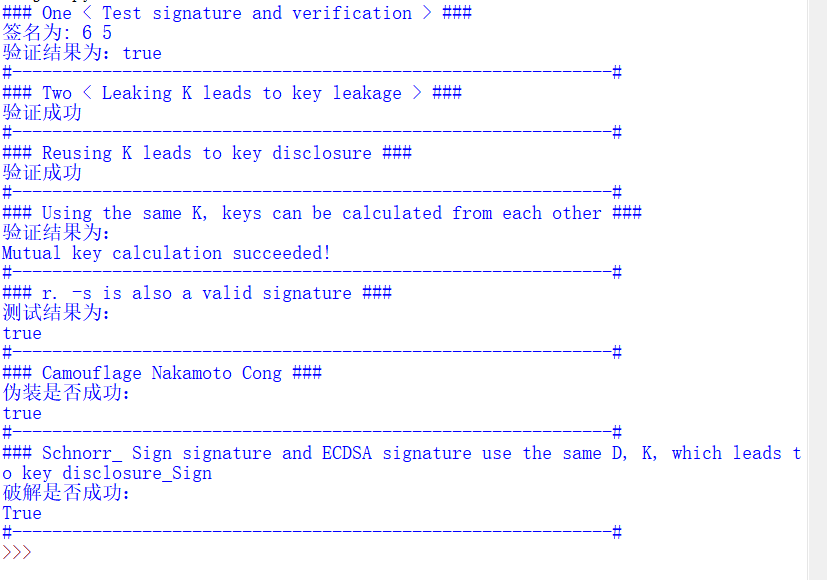

# ECDSA
##### % holder(CuifuKim) %  
PoC impl of the following pitfall:  
• Leaking 𝑘 leads to leaking of 𝑑   
• Reusing 𝑘 leads to leaking of 𝑑  
• Two users, using 𝑘 leads to leaking of 𝑑, that is they can deduce each other’s 𝑑 • Malleability of ECDSA, e.g. 𝑟, 𝑠 and 𝑟,−𝑠 are both valid 
signatures  
• Pretend to be satoshi as one can forge signature if the verification does not check 𝑚 • Same 𝑑 and 𝑘 used in ECDSA & Schnorr signature, leads to 
leaking of 𝑑  

# Implementation
<br>  
<center>  

</center>  

## Implement ECDSA signature:   
```python
def Ecdsa_Sign(m, n, G, d,k):
    e = hash(m)
    R = Multiply(k, G)
    r = R[0] % n
    s = (Gcd(k, n) * (e + d * r)) % n
    return r, s
```
## Achieve ECDSA certification:
```python
def Ecdsa_Verify(m, n, G, r, s, P):
    e = hash(m)
    w = Gcd(s, n)
    v1 = (e * w) % n
    v2 = (r * w) % n
    w = Add(Multiply(v1, G), Multiply(v2, P))
    if (w == 0):
        print('false')
        return False
    else:
        if (w[0] % n == r):
            print('true')
            return True
        else:
            print('false')
            return False
```

### DetailOne. Leaking 𝑘 leads to leaking of 𝑑 and Reusing 𝑘 leads to leaking of 𝑑.  
From the verification formula and the private key calculation formula, we can simply deduce:  
D = R-1 (k*s-e) mod N and R, K, s, e are known by the enemy, so it can be found.  

Both signatures use the same K. For the same g and P, R is the same, and the value of R is known. E1 and E2 are obtained from the information M1 and M2.
Simultaneous s calculation equation:
```c
s1 = k-1;  
(e1+dr) mod n;
s2 = k-1;
(e2+dr) mod n;
```
In the two formulas, the actual unknowns are only K and D, and D can be obtained by solving.  

```python
def k_Leaking(r,n,k,s,m):
    r_reverse=Gcd(r,n)
    e=hash(m)
    d=r_reverse * (k*s-e)%n
    return d
    
def k_Reuse(r1,s1,m1,r2,s2,m2,n):
    e1=hash(m1)
    e2=hash(m2)
    d=((s1 * e2 - s2 * e1) * Gcd((s2 * r1 - s1 * r1), n)) % n
    return d
```
### DetailTwo. users, using 𝑘 leads to leaking of 𝑑, that is they can deduce each other’s d.
```python
def Use_the_Same_k(s1,m1,s2,m2,r,d1,d2,n):
    e1=hash(m1)
    e2=hash(m2)
    d2_1 = ((s2 * e1 - s1 * e2 + s2 * r * d1) * Gcd(s1 * r, n)) % n
    d1_1 = ((s1 * e2 - s2 * e1 + s1 * r * d2) * Gcd(s2 * r, n)) % n
    if(d2==d2_1 and d1_1==d1):
        print("Success...")
        return 1
    else:
        print("Failure...")
        return 0
```
### DetiaThree. Malleability of ECDSA, e.g. 𝑟, 𝑠 and 𝑟,−𝑠 are both valid signatures.
From the formula of the verification algorithm, R, s and R, -s can pass the verification.
### DetailFour. Pretend to be satoshi as one can forge signature if the verification does not check m.
```python
def Pretend(r, s, n, G, P):
    u = random.randrange(1, n - 1)
    v = random.randrange(1, n - 1)
    r1 = Add(Multiply(u, G), Multiply(v, P))[0]
    e1 = (r1 * u * Gcd(v, n)) % n
    s1 = (r1 * Gcd(v, n)) % n
    Verify_without_m(e1, n, G, r1, s1, P)
```
### Same 𝑑 and 𝑘 used in ECDSA & Schnorr signature, leads to leaking of 𝑑.
When D and K are the same, K can be eliminated by using the calculation formulas of S1 and S2, and then the key D is obtained.  
```python
def Schnorr_and_ECDSA(r1, s1, R, s2, m, n):
    e1 = int(hash(m))
    e2 = int(hash(str(R[0]) + m))
    d = ((s1 * s2 - e1) * Gcd((s1 * e2 + r1), n)) % n
    return d
```

### TestDetail.

#### Test signature and verification
```python
  r,s=Ecdsa_Sign(m,n,G,d,k)
  print("Signifiture:",r,s)
  print("验证结果为：")
  Ecdsa_Verify(m,n,G,r,s,P)
```
#### Leaking K leads to key leakage
```python
  if (d == k_Leaking(r,n,k,s,m)):
     print("Validation successful...")
```
#### Reusing K leads to key disclosure
```python
  r_1,s_1=Ecdsa_Sign(m_1,n,G,d,k)
  r_2,s_2=Ecdsa_Sign(m,n,G,7,k)
  if (d == k_Reuse(r,s,m,r_1,s_1,m_1,n)):
     print("Validation successful...")
```
#### Using the same K, keys can be calculated from each other
```python
  print("The verification result is：")
  Use_the_Same_k(s_1,m_1,s_2,m,r,5,7,n)
```
#### r. -s is also a valid signature
```python
  print("The test result is：")
  Ecdsa_Verify(m,n,G,r,-s,P)
```
#### Camouflage Nakamoto Cong
```python
  print("Whether the camouflage is successful：")
  Pretend(r,s,n,G,P)
```
#### Schnorr_ Sign signature and ECDSA signature use the same D, K, which leads to key disclosure
```python
  r3,s3=Schnorr_Sign(m,n,G,d,k)
  d2=Schnorr_and_ECDSA(r,s,r3,s3,m,n)
  print("Whether the cracking is successful：")
  print(d == d2)
```

## End
